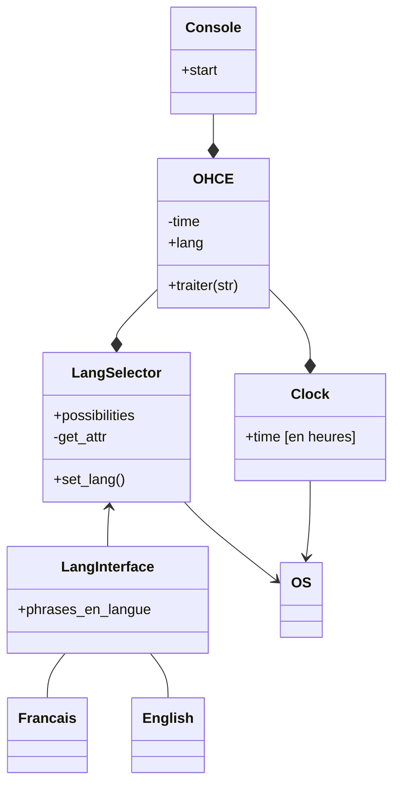
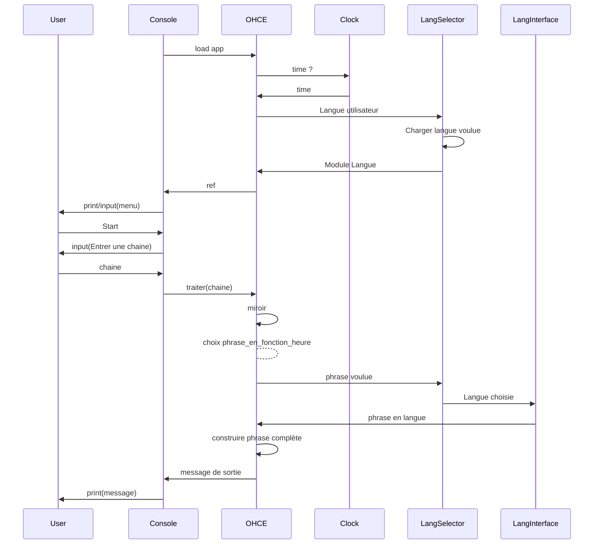

# Appli_reverse_palindrome

Exercice réalisé en python (version 3.10+)

L'objectif est d'apprendre à utiliser des Stubs, Builders, Generateurs, ... liés aux méthodologies de tests.
Il est aussi demandé d'utiliser les capacités des Frameworks de test tels que Parameterized, Hypothesis et autres.

# Décomposition de l'exercice:

Pour compléter cet exercice, on prends une interface simple, qui sera reliée à l'heure du système, ainsi qu'un choix de
langue possible pour l'utilisateur.
Le but de l'interface est de renvoyer le mot en miroir, décoré de 'bonjour', 'au revoir', 'bien dit' dans le cas d'un
palindrome.
Chaque mot devra dépendre de la langue et de l'heure actuelle.

#### Pour initialiser l'environnement :

```shell
py setup.py
```

#### Pour exécuter TOUS les tests :

---

```shell
.\venv\Scripts\python -m pytest
```

#### Pour lancer l'interface de console :

```shell
.\venv\Scripts\python main.py
```





# Résultats des tests

```txt
================= test session starts =================================================================================
platform win32 -- Python 3.11.0, pytest-7.2.1, pluggy-1.0.0

rootdir: C:\*****\pedago-tests\Appli_reverse_palindrome

plugins: hypothesis-6.62.1

collected 30 items

tests\test_01_OHCE_Unittest.py .........................                                                                                                                         [ 83%]

tests\test_02_OHCE_Integration.py ..                                                                                                                                             [ 90%]

tests\test_03_OHCE_Found_Bugs.py ..                                                                                                                                              [ 96%]

tests\test_04_extra_integrations.py .                                                                                                                                            [100%]

================= 30 passed in 0.09s ==================================================================================
```
